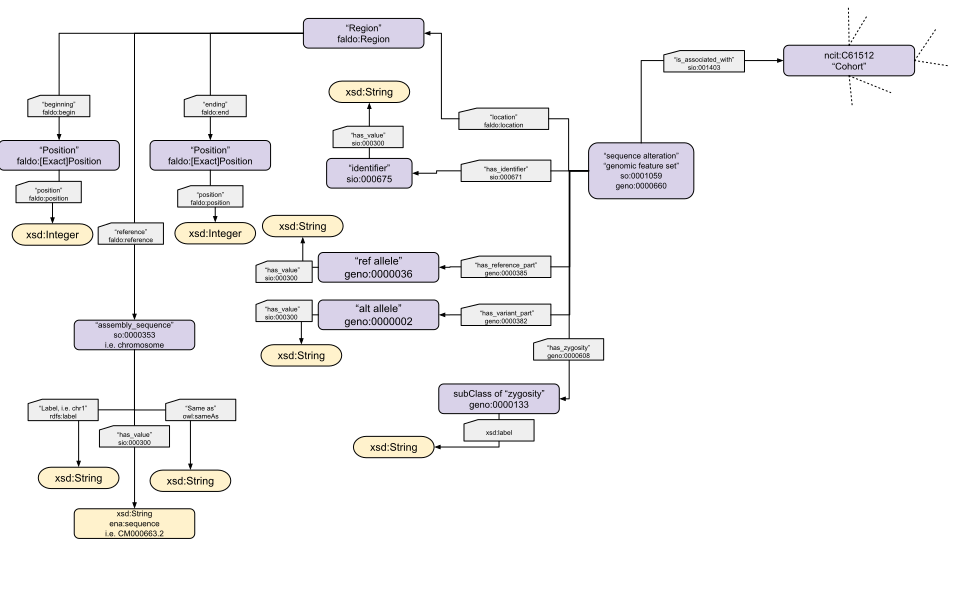
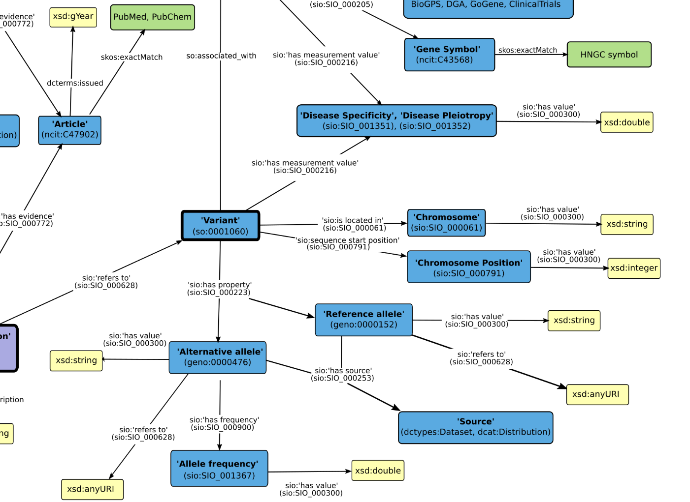

# Genomic variants schema
Representing genomic variants as Linked Data using expert domain ontologies

# Schema documentation
https://swat4hcls-2025-genomic-variation.github.io/genomic-variant-schema/

# Hand-drawn schema
As of 21-02-2025

# Ontology choice
SO:

FALDO:

GENO:

SIO:

# Other existing schemas and datamodels
Other project provide schemas to represent genomic variants.
#### med2rdf 
http://med2rdf.org/
#### togovar 
https://togovar.org/ (backend in RDF apparently, and there is a schema somewhere?)
#### disgenet
sparql endpoint discontinued since 2024, but below is a screenshot of their previously available schema

#### GA4GH VRS
https://www.ga4gh.org/product/variation-representation/

